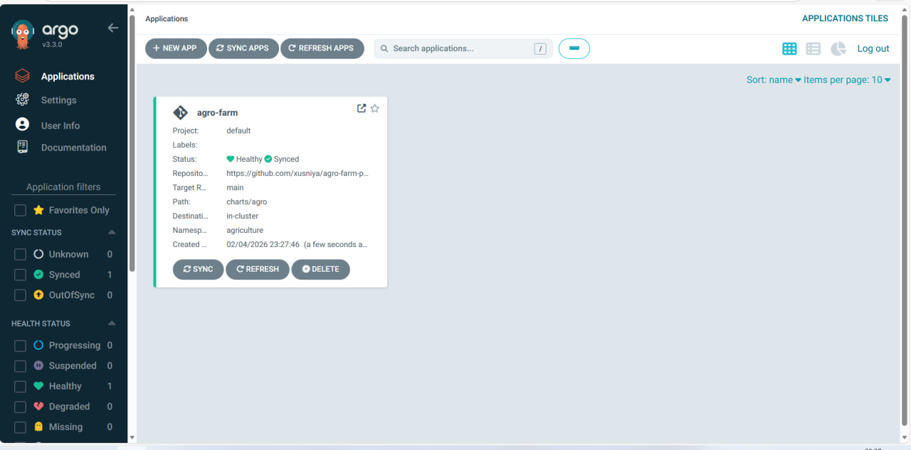
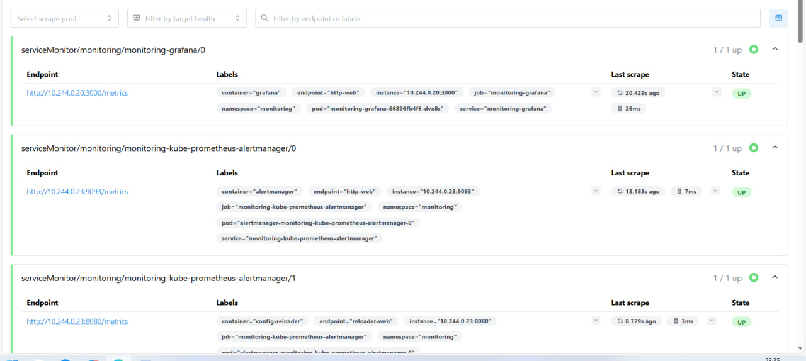
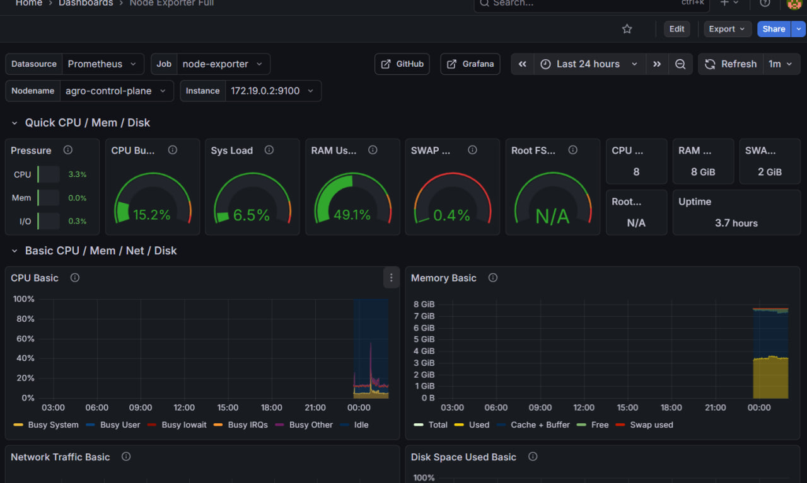
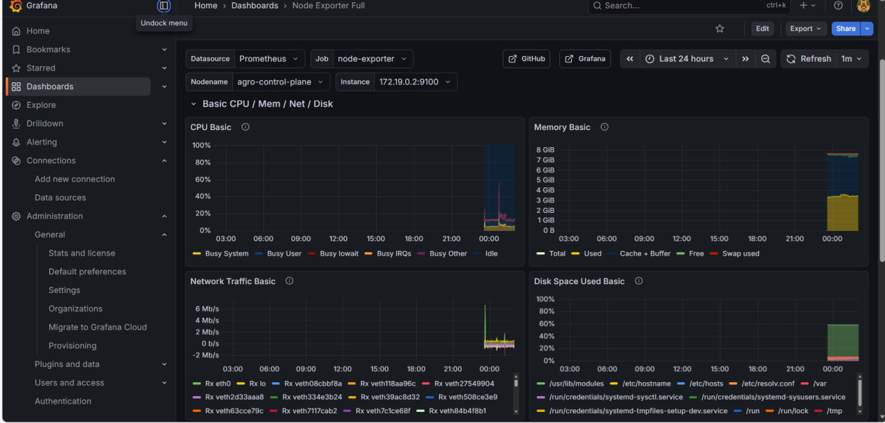

#  Agro Farm Platform

Agro Farm Platform is a **Django-based backend application** that demonstrates a
complete **cloud-native DevOps workflow** using Docker, Kubernetes, Helm,
GitHub Actions, and Prometheus monitoring.

---

##  Tech Stack

- Backend: Django (Python)
- Containerization: Docker
- Orchestration: Kubernetes (Kind)
- Packaging: Helm
- CI/CD: GitHub Actions (GHCR)
- Monitoring: Prometheus (ServiceMonitor)

---

##  Project Structure

\\\
agro-farm-platform/
 agro/
 config/
 charts/
    agro/
 monitoring/
    agro-servicemonitor.yaml
 docs/
    screenshots/
 Dockerfile
 docker-compose.yml
 entrypoint.sh
 requirements.txt
 README.md
\\\

---

##  Run with Docker

\\\ash
docker build -t agro-farm-platform .
docker run -p 8000:8000 agro-farm-platform
\\\

Open in browser:  
http://localhost:8000

---

##  Kubernetes Deployment (Helm)

\\\ash
kind create cluster --name agro --config kind-config.yaml
helm upgrade --install agro charts/agro -n agriculture --create-namespace
\\\

Check pods:

\\\ash
kubectl get pods -n agriculture
\\\

---

##  Monitoring (Prometheus)

\\\ash
kubectl apply -f monitoring/agro-servicemonitor.yaml
\\\

---

##  Screenshots

### Prometheus Targets

### Kubernetes Pods

### Helm Release

### ServiceMonitor

### GitHub Actions CI/CD

---

##  CI/CD

GitHub Actions automatically builds and pushes Docker images to
**GitHub Container Registry (GHCR)** on every push to the main branch.

---

##  Author

**Xusniya Turdiqulova**  
GitHub: https://github.com/xusniya

---

##  License

Educational & portfolio project.
